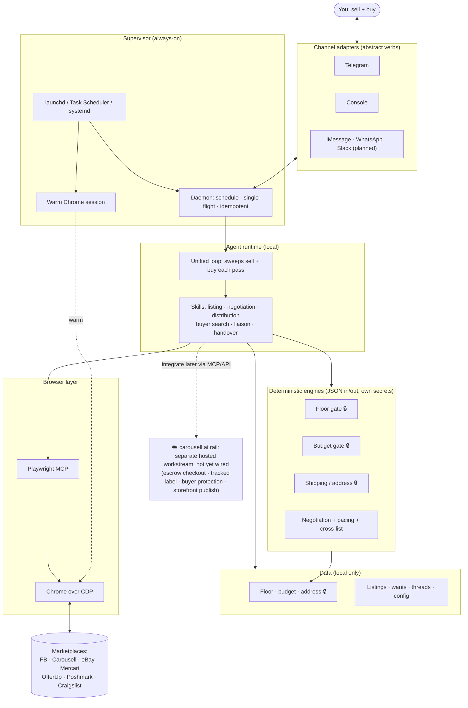

# Architecture Overview

A public overview of how Bazaar Skills is built and where it's going. For the day-to-day docs see
[README.md](README.md), [SETUP.md](SETUP.md), and [DAEMON.md](DAEMON.md); for what's planned see
[ROADMAP.md](ROADMAP.md).

## What it is

Bazaar Skills is a **local, single-tenant agent that both sells and buys** for you on informal P2P
marketplaces. It runs on your own machine, drives **your real, logged-in Chrome** (over the Chrome
DevTools Protocol via Playwright MCP), and you talk to it over one chat channel. One unified loop
sweeps both sides each pass: on the **sell** side it lists items and negotiates with buyers; on the
**buy** side it searches for what you want, shortlists matches, and negotiates with sellers, the
faithful inverse of selling (counter *up* to a hidden ceiling instead of *down* to a hidden floor).

There is **no hosted plane**: every secret and every record stays on your device.

## Design principles

- **Agnostic by design.** Channel-, OS-, harness-, and model-agnostic via adapter seams. New
  channels, operating systems, agent harnesses, and per-task model choices slot in behind stable
  interfaces. The seams are at different stages: the channel seam is clean (the iMessage and WhatsApp
  adapters are already built and daemon-dispatched, pending onboarding exposure), while the OS seam
  needs some core work beyond a new adapter — the daemon's single-instance lock, notification trigger,
  and health checks still assume macOS. Wired for runtime today: Telegram and console, macOS, Claude
  Code (see [ROADMAP.md](ROADMAP.md) for what's next).
- **Deterministic money code owns the secrets.** The only logic that touches your hidden floor, your
  max budget, and your exact address is plain, tested Python with JSON in and JSON out. Those values
  never enter a prompt, reply, listing, or transcript. The language model never sees them.
- **Your real session, paced like a human.** The agent acts as you in your existing logged-in browser
  with jittered, rate-capped pacing, and re-authenticates on checkpoints. It never logs in for you.
- **Ship-only while the agent runs the chat.** Every deal resolves to one clear total of price plus
  delivery, and the agent hands control back to you to complete payment and handover.

## The three layers

- **Channel.** How you talk to the agent. Adapter-agnostic flows are written against a small set of
  abstract verbs, so every channel behaves identically and new ones drop in the same way.
- **Browser.** How it acts on marketplaces. A shared action vocabulary plus per-site recipes drive
  your real Chrome session, so the agent acts as you with your existing logins. Controls are re-found
  visually, so a moved button is re-found rather than a break.
- **Deterministic money code.** The tested Python engines that own every secret and every
  irreversible decision (accept/counter/reject against your floor or budget, delivery-fee math,
  account-safety pacing). JSON in, JSON out, no model in the loop.

## System diagram

## Seller flow (brief)

1. **List in one message.** Vision identifies the item, pulls recent comps, drafts the title and
   description.
2. **Set your numbers.** You confirm a public list price and a private floor (which never leaves the
   floor gate), then confirm delivery size for the shipping math.
3. **Publish.** The agent posts to your enabled marketplaces and works buyers from there, answering
   from a learned Q&A bank and negotiating within your floor. An above-list or bidding offer always
   checks with you first.
4. **Close.** When a deal is agreed, the agent coordinates delivery and marks the item sold
   everywhere it was listed.

## Buyer flow (brief)

1. **Search.** You describe a want; the agent searches each marketplace, de-dupes, verifies URLs, and
   ranks a shortlist, then asks your target and max.
2. **Liaise.** It opens with a sensible offer below list and under your max, then classifies each
   seller reply and counters hands-free, pursuing several sellers per want.
3. **Close.** When one deal lands it closes the others, agrees postage and a payment method, and hands
   you a summary with the landed total. The human completes the payment.

## Trust & safety invariants

- **Floor stays local.** Read only by the floor gate; never in a prompt, reply, listing, or
  transcript.
- **Max budget stays local.** Read only by the budget gate; the buyer engine walks away rather than
  ever offer above it.
- **Address stays local.** Your exact address is read only by the shipping engine for the distance
  calc; buyers see a delivery fee, not your address.
- **Listing URLs are real.** Read from the live page and verified (region-correct) before being
  stored or messaged, never fabricated.
- **Account safety.** An atomic per-marketplace hourly cap (shared across sell and buy on one
  account), jitter, quiet hours, and escalate-rather-than-retry.
- **Idempotent and resumable.** Per-thread cursors mean a restart or a mid-flight pause never
  double-acts, and terminal threads are never re-engaged.

## Built today vs planned

| Dimension | Today | Planned ([ROADMAP.md](ROADMAP.md)) |
|---|---|---|
| **Marketplaces** | FB · Carousell · eBay · Mercari · OfferUp · Poshmark · Craigslist | Depop · ThredUp · Nextdoor |
| **Channels** | Telegram · console | iMessage · WhatsApp (adapters built + daemon-dispatched, onboarding pending) · Slack · multiple at once (planned) |
| **OS** | macOS | Windows (adapter started) · Linux (needs core work beyond an adapter) |
| **Harness / model** | Claude Code | additional harnesses (Codex install layer exists, runtime stubbed) · flexible model selection |
| **Checkout** | manual handover | carousell.ai escrow checkout (hosted rail, not yet wired) |
| **Distribution** | cross-list to the marketplaces you enable | carousell.ai storefront publish (hosted rail, not yet wired) |
